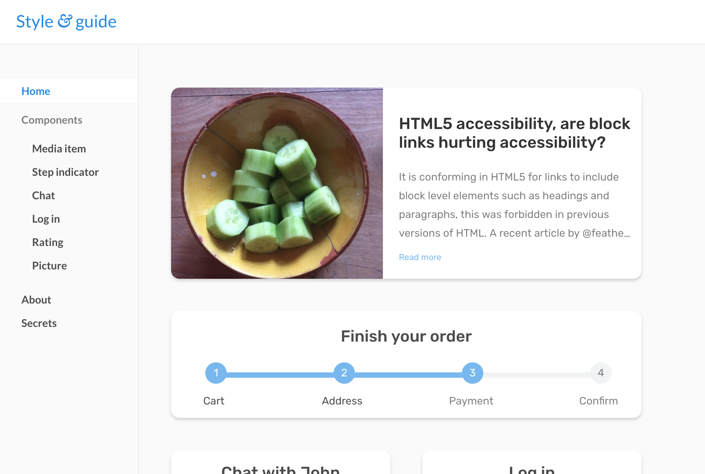

# CSS To The Rescue

Week 1: [https://viennam.github.io/cssttr/week1/](https://viennam.github.io/cssttr/week1/)

Week 2: [https://viennam.github.io/cssttr/week2/style.guide.html](https://viennam.github.io/cssttr/week2/styleguide.html)

Week 3: [https://viennam.github.io/cssttr/week3/style.guide.html](https://viennam.github.io/cssttr/week3/styleguide.html)

## Components

Rating example makes use of Emoji from: http://emojione.com
